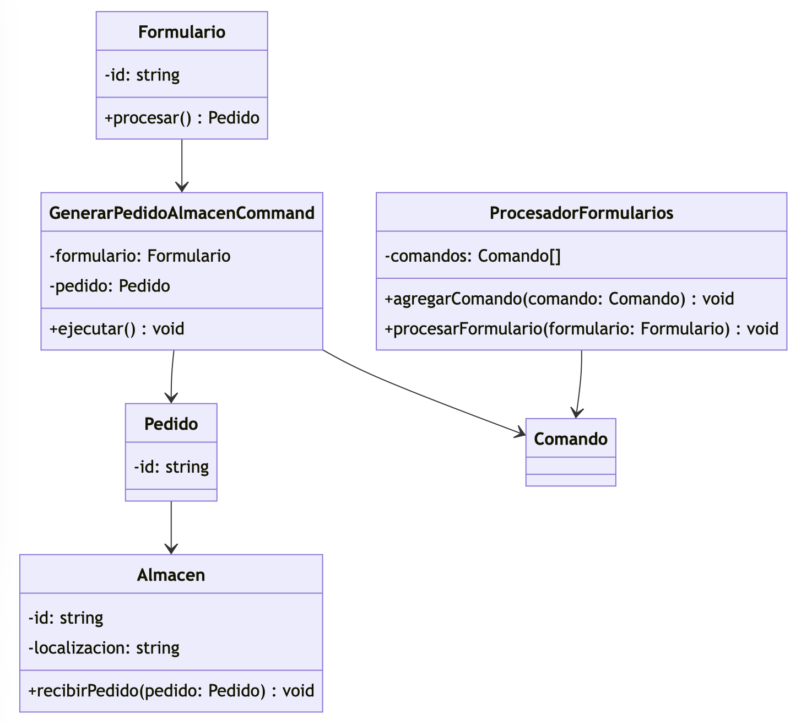
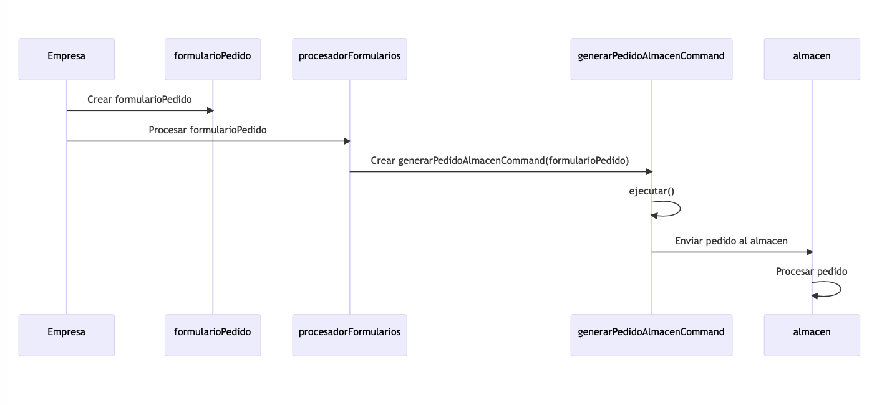
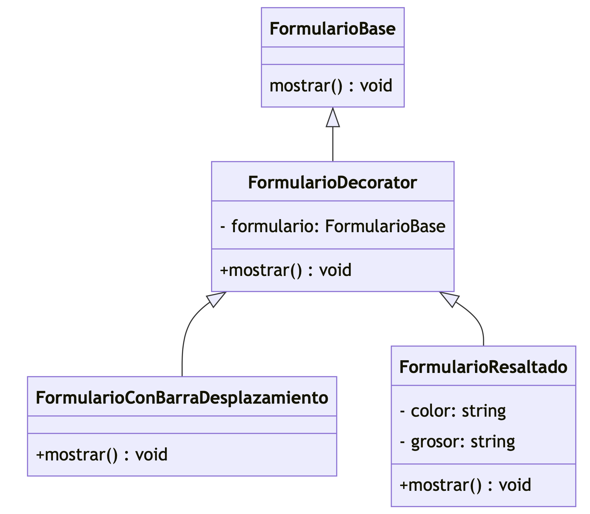

# Ejercicio: Distribuidora

## Ejercicio a

Aplicar el patrón command al dominio del problema propuesto de modo que se permita automatizar el procesamiento del formulario que genera un pedido al almacén, pero contemplando la posibilidad de añadir en el futuro nuevos tipos de formularios produciendo el menor impacto posible en el resto de la aplicación.

## Ejercicio b

El diagrama de secuencia que tiene lugar desde que la empresa crea el formulario que recoge los datos de un pedido al almacén (formularioPedido) hasta que termina su procesamiento en el almacen.
Nota importante: los datos del pedido que se han recogido a través del formulario son necesarios para la elaboración del pedido que se envía al almacén.

En este diagrama, "Empresa" crea el formularioPedido, luego lo envía al "procesadorFormularios" para su procesamiento. El "procesadorFormularios" crea un "generarPedidoAlmacenCommand" utilizando el formularioPedido como parámetro. Finalmente, el "generarPedidoAlmacenCommand" se ejecuta, generando y enviando el pedido al "almacen", donde se realiza el procesamiento correspondiente.

## Ejercicio c

A la hora de mostrar los distintos formularios en pantalla surgen distintas necesidades, ya que algunos formularios serán más largos que otros, necesitando el uso de la barra de desplazamiento solo los largos. Además se contempla la posibilidad de resaltar algunos de ellos en función de su importancia y/o urgencia con un borde de un determinado color y/o grosor. Nótese que un informe que se quiera resaltar con un
borde puede también ser largo. Nótese también que un formulario puede que se deba resaltar por más de un motivo, lo que implicaría la superposición de varios bordes.
¿Qué patrón de diseño se podría utilizar en este caso de forma que el hecho de cómo se muestra cada formulario pasara desapercibido para el resto del código? Incluir el diseño de dicho patrón.

Se puede utilizar el patrón Decorator, que permite adjuntar responsabilidades adicionales a un objeto dinámicamente, sin afectar a otros objetos de la misma clase.

En este caso, se pueden definir decoradores que agreguen características específicas a los formularios, como la barra de desplazamiento, el resaltado y múltiples bordes. Estos decoradores pueden combinarse y aplicarse de manera flexible a los formularios sin afectar la forma en que se muestran en el resto del código.
